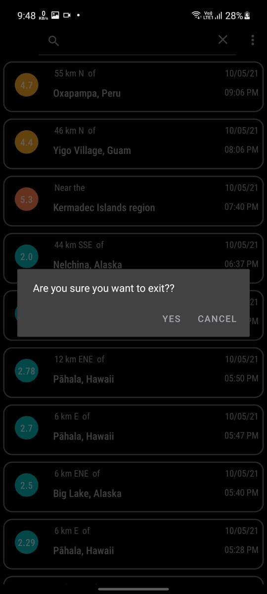

# QuakeWatch
Developed an Android App called QuakeWatch for users to monitor earthquakes happening around world.

### Highlights

* MAP implementation
* In-App WebBrowser
* USGS Earthquake API
* User can choose theme Light or Dark
* 7 different MAP themes are available
* Swipe down to refresh the earthquake data
* Swipe left to get NEWS feed about earthquakes
* Search feature, user can search earchquakes by country name or by magnitude

### MAP API Key
You will need to register a Key for Google Map API for this project, go to API Console  
https://support.google.com/googleapi/answer/6158862?hl=en. And then Use your API key as the value  for google_maps_key in the strings.xml file under the res/values directory.

### USGS API
Fetched the real-time data in GeoJSON format from US Geological Survey Website 
https://earthquake.usgs.gov/fdsnws/event/1/

### GNews API
Using Free plan of GNews API. it will send 10 articles per request and provide 100 requests per dat.  
You will need to regester to gnews.io to get API key and you can fetch news from GNews.  
https://gnews.io/  

### DEMO

https://user-images.githubusercontent.com/53445530/117691268-578fe600-b1d9-11eb-901d-9ad946ff2d92.mp4

### More Info
This app displays a list of recent earthquakes in the world from the U.S. Geological Survey (USGS) organization. 
Used in a Udacity course in the Beginning Android Nanodegree, But I implemented some advanced and more complex features.  
<a href="https://www.udacity.com/course/android-basics-networking--ud843?autoenroll=true#">Android Basics: Networking.</a>
